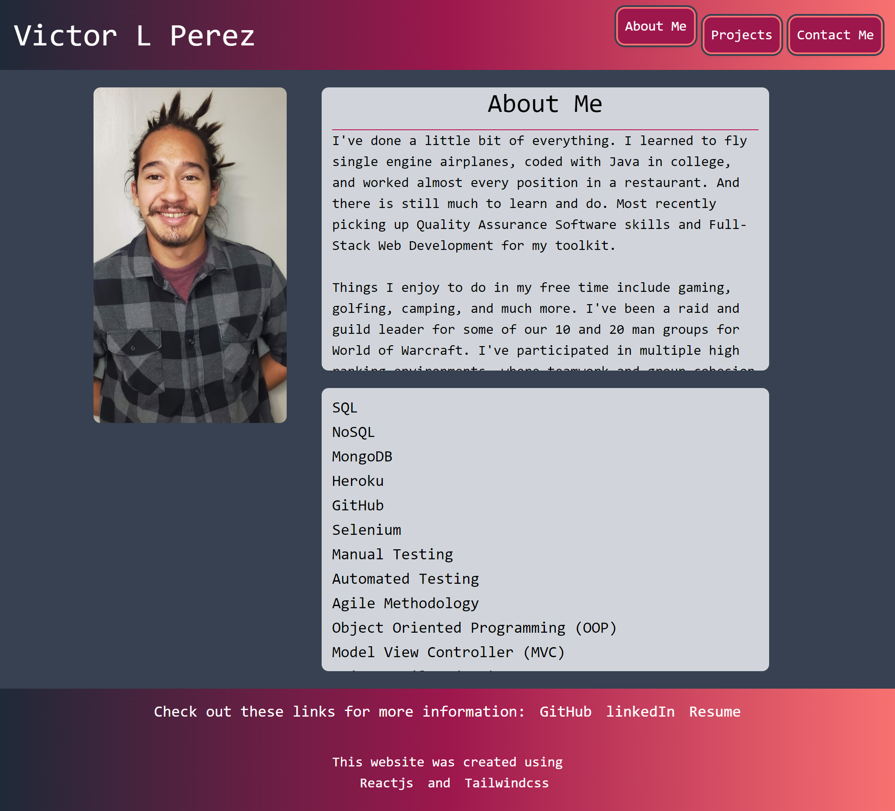

# My React Portfolio

In this project I used React and tailwind CSS, to create a protfolio that shows some of my many works and provide links to my Github, LinkedIn, and resume.

## Future Features

- Contact form actually sending info to provided email
- Sign In and Login
- Ability to gather points for clicking on different items in the portfolio
- Users will have their own personal dash board to provide feed back, and track their points, and things to do on the website

## Site Link

The website is viewable at this link: [Reactfolio](https://zunaty.github.io/reactfolio/)

## Site Preview

